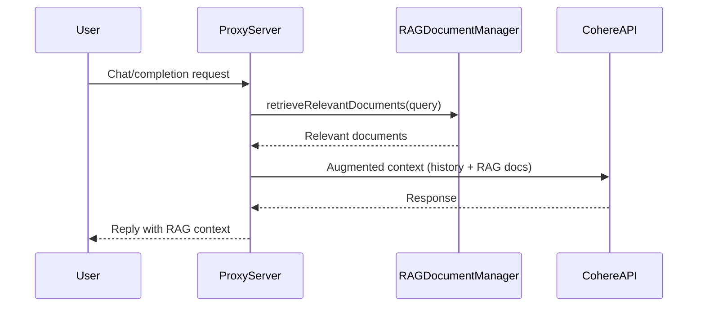

# Cohere Proxy Server Architecture

## Overview

The Cohere Proxy Server translates OpenAI-compatible requests to Cohere's API, providing token estimation, dynamic model support, robust error handling, and production-grade reliability.

# Architecture

This repository moved from a single-file CommonJS layout to a small ESM-based service split under `src/`.

High level components
- `src/index.mjs` — HTTP server, routes and wiring. Exposes the same public endpoints (`/v1/chat/completions`, `/v1/rag/*`, `/v1/conversations/*`) so clients and integrations remain compatible.
- `src/ragDocumentManager.mjs` — RAG document store and index. Indexing is now queue-based and runs off the request path to avoid blocking web requests. Embeddings are cached using an LRU+TTL cache.
- `src/conversationManager.mjs` — Conversation state, RAG context enrichment, and session lifecycle. Uses pruning/LRU to avoid unbounded memory growth and exposes graceful shutdown hooks.
- `src/utils/lruTtlCache.mjs` — Small in-repo LRU TTL cache used for embeddings and prompt caching. Replaces the older `memoryCache.js`.

Observability and infra
- Structured logging with `pino` inserted into the request context for correlation.
- Basic Prometheus metrics stub using `prom-client` (counter for HTTP requests). Expand as needed.
- Health endpoint (`GET /health`) that reports conversation and rag stats and basic limits.

Design notes
- Indexing and embedding calls are performed asynchronously: `indexCodebase()` enqueues a job and the manager processes that queue in the background.
- Semantic search prefers cached document embeddings; on failure it falls back to fast keyword search.
- The server keeps backwards-compatible request/response shapes for ease of migration.
- **RAGDocumentManager**: Handles indexing, semantic and keyword search, and retrieval of relevant documents from the codebase or knowledge sources.
- **Integration Points**: RAG is invoked during chat/completion requests. The conversation manager retrieves relevant documents for each user query and injects them as context into the conversation history.
- **Flow**:
  1. User sends a chat/completion request.
  2. The system extracts the query and calls `retrieveRelevantDocuments` on the RAGDocumentManager.
### RAGDocumentManager Class

The `RAGDocumentManager` is responsible for managing the retrieval-augmented knowledge base. Its main responsibilities include:

- **Indexing**: Scans files and directories, splits content into chunks, and stores metadata for efficient retrieval.
- **Semantic Search**: Uses embeddings to find documents relevant to a query based on meaning.
- **Keyword Search**: Performs fast keyword-based lookups for additional recall.
- **Retrieval**: Combines semantic and keyword results, deduplicates, and ranks them for relevance.
- **Utilities**: Includes language detection, file categorization, and extraction of functions/classes/imports for enhanced indexing.

#### RAG Integration Sequence

Key methods:
- `indexCodebase(projectPath, options)`: Indexes an entire codebase.
- `indexFile(filePath)`: Indexes a single file.
- `retrieveRelevantDocuments(query, options)`: Retrieves and ranks relevant documents for a query.
- `semanticSearch(query, options)`: Embedding-based search.
- `keywordSearch(query, options)`: Keyword-based search.
- `getEmbedding(text)`: Gets vector embeddings for text.
- `getStats()`: Returns index statistics.

This class is central to the RAG workflow, enabling dynamic, context-aware augmentation of user queries.
  3. Retrieved documents are formatted and injected into the conversation context.
  4. The augmented context is sent to the Cohere API for response generation.
  5. The response is returned to the user, with RAG context included in the session history.

This architecture enables dynamic, context-aware responses by leveraging both conversation history and relevant external knowledge.

- **Stateless, horizontally scalable, Docker-ready**
- **Endpoints:** `/v1/chat/completions`, `/health`
- **Class-based design:** [`CohereProxyServer`](../src/index.mjs:22) manages all server logic
- **Async Initialization:** Supported models are fetched asynchronously in the `start` method, not in the constructor, ensuring proper startup sequencing.
- **Modular Handlers:** Request processing is broken into small, focused methods for validation, transformation, API calls, error handling, and response formatting.

## Request Flow

1. Client sends OpenAI-format request.
2. Middleware applies security, rate limiting, CORS, logging, and parsing.
3. Input is validated and converted to Cohere format.
4. Supported models are checked (with fallback to defaults if API fails).
5. Cohere API is called using the correct method (`models.list()` for models, `generate()` for completions).
6. Response is processed, tokens estimated, and formatted for the client.
7. Errors are handled with specific status codes and error types.

## Key Components

- **Security:** Helmet, CORS, rate limiting, API key validation
- **Monitoring:** Morgan logging, health endpoint, performance metrics
- **Validation:** Parameter, range, and model validation
- **Transformation:** Converts OpenAI messages to Cohere format
- **Error Handling:** Structured error responses by category, with processing time and error type
- **Caching:** In-memory cache for prompt responses
- **Token Management:** Smart estimation, overflow handling, and allocation for prompt and completion tokens
- **Fallback Handling:** Uses default models if Cohere API is unavailable

## Configuration

All configuration is via environment variables:
- `PORT`
- `COHERE_API_KEY`
- `ALLOWED_ORIGINS`
- `MAX_TOTAL_TOKENS`
- `MIN_COMPLETION_TOKENS`
- `MAX_COMPLETION_TOKENS`
- `TOKEN_SAFETY_BUFFER`
- `RATE_LIMIT_WINDOW_MS`
- `RATE_LIMIT_MAX_REQUESTS`

## Deployment

- Graceful shutdown on SIGTERM/SIGINT
- Health check endpoint at `/health`
- Dockerfile for containerization

## Testing

- Unit and integration tests for all major features
- Performance/load tests

## Extension Points

- Add custom middleware in `setupMiddleware`
- Add new endpoints in `setupRoutes`
- Enhance responses with additional metadata

## Monitoring

- Structured request and error logging
- Metrics: response time, token usage, error rates

## Recent Improvements

- **API compatibility:** Uses `models.list()` instead of deprecated `listModels()`
- **Async/await patterns:** No async logic in constructor; all async initialization in `start`
- **Enhanced error handling:** Specific status codes and error types, with processing time in responses
- **Code modularity:** Main handler split into focused methods
- **Token management:** Comprehensive estimation and overflow handling
- **Fallbacks:** Default models used if Cohere API is unavailable
- **Modern JavaScript:** Deprecated methods replaced, clean destructuring, and best practices throughout
