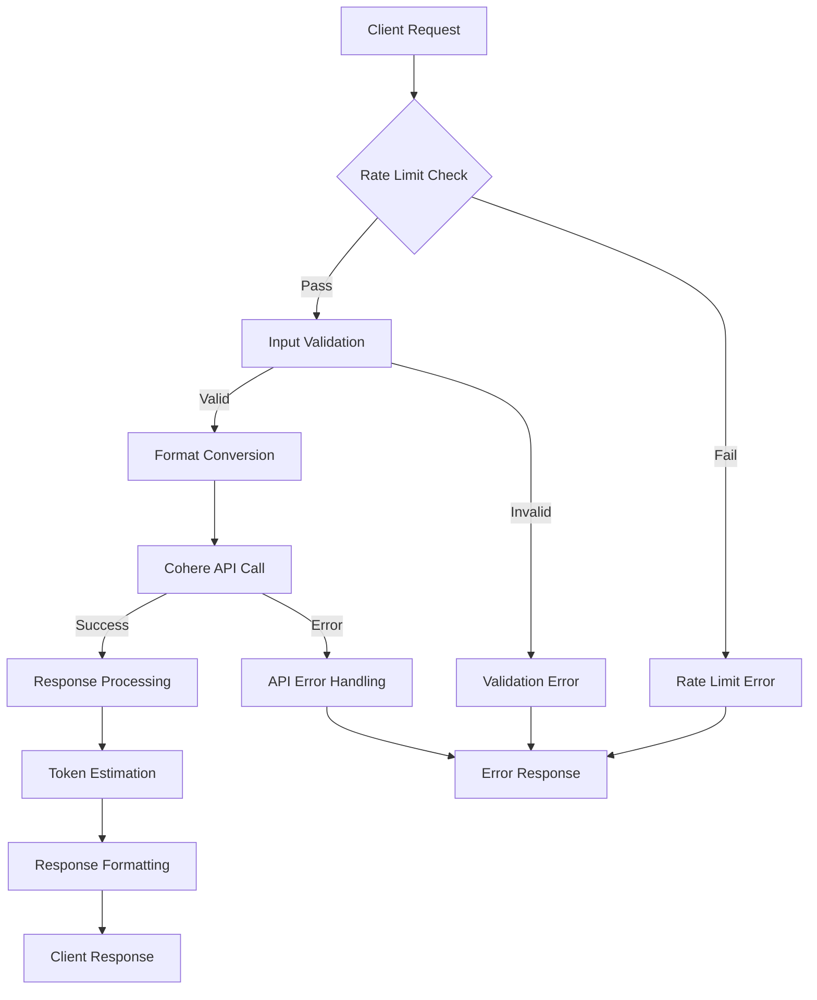
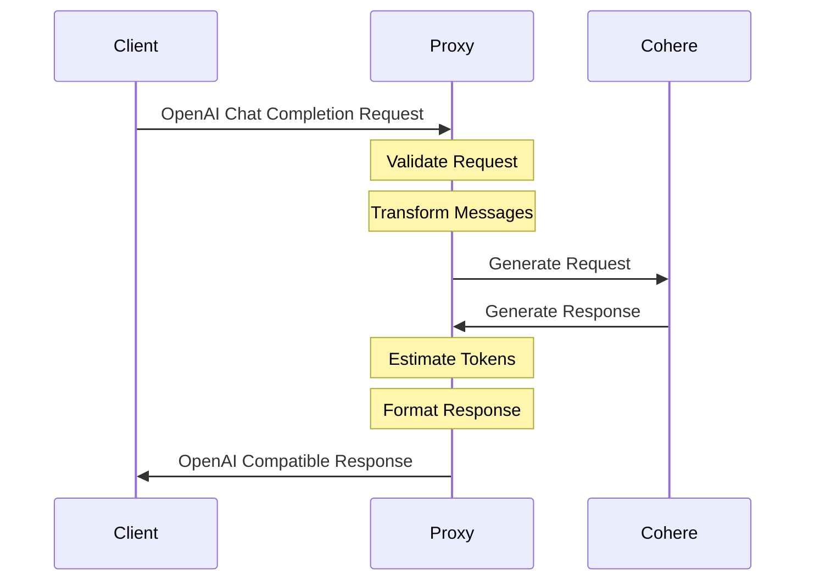

# Cohere Proxy Server Architecture

This document provides a detailed technical overview of the Cohere Proxy Server architecture, design decisions, and implementation details.

## 🏗️ System Architecture

### High-Level Overview

```
┌─────────────────┐    ┌─────────────────────┐    ┌─────────────────┐
│                 │    │                     │    │                 │
│   Client App    ├────┤  Cohere Proxy      ├────┤  Cohere API     │
│  (OpenAI API)   │    │     Server          │    │                 │
│                 │    │                     │    │                 │
└─────────────────┘    └─────────────────────┘    └─────────────────┘
```

The proxy server sits between client applications and Cohere's API, translating requests and responses to maintain OpenAI API compatibility.

### Request Flow

```
1. Client Request (OpenAI format)
   ↓
2. Middleware Stack
   ├── Security Headers (Helmet)
   ├── Rate Limiting
   ├── CORS Validation
   ├── Request Logging (Morgan)
   └── Body Parsing
   ↓
3. Input Validation
   ├── Parameter Validation
   ├── Model Validation
   └── Message Format Validation
   ↓
4. Format Conversion
   ├── OpenAI → Cohere Format
   └── Prompt Construction
   ↓
5. Cohere API Call
   ↓
6. Response Processing
   ├── Token Estimation
   ├── Format Conversion (Cohere → OpenAI)
   └── Response Enhancement
   ↓
7. Client Response (OpenAI format)
```

## 🏛️ Class Structure

### CohereProxyServer Class

The main server class follows the Single Responsibility Principle with clear method separation:

```javascript
class CohereProxyServer {
  constructor()           // Initialize server components
  setupMiddleware()       // Configure Express middleware
  setupRoutes()          // Define API endpoints
  setupErrorHandling()   // Global error handlers
  handleChatCompletion() // Main business logic
  formatMessagesForCohere() // Request transformation
  validateModel()        // Model validation
  estimateTokens()       // Token usage calculation
  generateId()           // Unique ID generation
  start()               // Server startup
}
```

### Dependency Injection

The class uses dependency injection for the Cohere client, making it testable and configurable:

```javascript
this.cohere = new CohereClient({
  token: process.env.COHERE_API_KEY,
});
```

## 🔧 Component Architecture

### 1. Middleware Stack

**Security Layer:**
- **Helmet**: Adds security headers (XSS protection, HSTS, etc.)
- **CORS**: Configurable cross-origin request handling
- **Rate Limiter**: IP-based request throttling

**Monitoring Layer:**
- **Morgan**: HTTP request logging
- **Custom Logging**: Error tracking and performance metrics

**Parsing Layer:**
- **JSON Parser**: Request body parsing with size limits
- **URL Encoded Parser**: Form data handling

### 2. Validation Layer

**Input Validation:**
```javascript
// Parameter validation
if (!messages || !Array.isArray(messages)) {
  throw new ValidationError('Messages array required');
}

// Range validation
if (temperature < 0 || temperature > 2) {
  throw new ValidationError('Temperature out of range');
}

// Model validation
if (!allowedModels.includes(model)) {
  throw new ValidationError('Unsupported model');
}
```

### 3. Transformation Layer

**Message Format Conversion:**
```javascript
// OpenAI format → Cohere format
formatMessagesForCohere(messages) {
  let prompt = '';
  for (const message of messages) {
    if (message.role === 'system') {
      prompt += `System: ${message.content}\n\n`;
    } else if (message.role === 'user') {
      prompt += `Human: ${message.content}\n\n`;
    }
  }
  return prompt + 'Assistant:';
}
```

### 4. Error Handling Layer

**Structured Error Responses:**
```javascript
const errorResponse = {
  error: {
    message: 'Detailed error message',
    type: 'error_category',
    timestamp: new Date().toISOString()
  }
};
```

**Error Categories:**
- `authentication_error`: API key issues
- `invalid_request_error`: Bad request parameters
- `rate_limit_exceeded`: Rate limiting violations
- `internal_server_error`: Server-side failures
- `not_found`: Invalid endpoints

## 📊 Data Flow Diagrams

### Request Processing Flow



### Message Transformation Flow



## 🔒 Security Architecture

### Defense in Depth

**Layer 1: Network Security**
- Rate limiting per IP address
- CORS origin validation
- Request size limitations

**Layer 2: Application Security**
- Input validation and sanitization
- SQL injection prevention (parameterized queries)
- XSS protection via Helmet

**Layer 3: Authentication & Authorization**
- API key validation
- Environment variable security
- No sensitive data in logs

**Layer 4: Error Handling Security**
- Sanitized error messages
- No stack traces in production
- Structured error responses

### Security Headers (via Helmet)

```javascript
helmet() // Adds:
// - X-Content-Type-Options: nosniff
// - X-Frame-Options: DENY
// - X-XSS-Protection: 1; mode=block
// - Strict-Transport-Security (HSTS)
// - Content-Security-Policy headers
```

## 📈 Performance Architecture

### Optimization Strategies

**1. Efficient Request Processing**
- Minimal middleware stack
- Early validation to fail fast
- Streaming response capability

**2. Memory Management**
- No persistent state storage
- Efficient string manipulation
- Garbage collection friendly patterns

**3. Token Estimation Algorithm**
```javascript
estimateTokens(text) {
  // Simple but effective estimation
  // 1 token ≈ 4 characters for English
  return Math.ceil(text.length / 4);
}
```

### Performance Monitoring

**Metrics Collected:**
- Request processing time
- Token usage estimates
- Error rates by type
- Rate limit hit rates

**Logging Strategy:**
- Structured logging with timestamps
- Performance metrics in milliseconds
- Error context without sensitive data

## 🔧 Configuration Architecture

### Environment-Based Configuration

```javascript
// Configuration hierarchy
const config = {
  port: process.env.PORT || 3000,
  cohereApiKey: process.env.COHERE_API_KEY, // Required
  allowedOrigins: process.env.ALLOWED_ORIGINS?.split(',') || ['*'],
  rateLimitWindow: 15 * 60 * 1000, // 15 minutes
  rateLimitMax: 100, // requests per window
  bodyLimit: '10mb',
  defaultTemperature: 0.7,
  defaultMaxTokens: 300
};
```

### Model Configuration

```javascript
const MODEL_CONFIG = {
  allowedModels: [
    'command-r',
    'command-r-plus',
    'command',
    'command-nightly',
    'command-light',
    'command-light-nightly'
  ],
  defaultModel: 'command-r',
  modelMapping: {
    'gpt-3.5-turbo': 'command-light',
    'gpt-4': 'command-r-plus'
  }
};
```

## 🚀 Deployment Architecture

### Production Deployment Considerations

**1. Process Management**
```javascript
// Graceful shutdown handling
process.on('SIGTERM', gracefulShutdown);
process.on('SIGINT', gracefulShutdown);

function gracefulShutdown() {
  server.close(() => {
    console.log('Server closed gracefully');
    process.exit(0);
  });
}
```

**2. Health Monitoring**
```javascript
// Health check endpoint
app.get('/health', (req, res) => {
  res.json({
    status: 'healthy',
    timestamp: new Date().toISOString(),
    uptime: process.uptime(),
    version: process.env.npm_package_version
  });
});
```

**3. Load Balancing Considerations**
- Stateless design enables horizontal scaling
- No session storage requirements
- Rate limiting per-instance or shared Redis

### Container Architecture (Docker)

```dockerfile
# Suggested Dockerfile structure
FROM node:18-alpine
WORKDIR /app
COPY package*.json ./
RUN npm ci --only=production
COPY . .
EXPOSE 3000
USER node
CMD ["node", "server.js"]
```

## 🧪 Testing Architecture

### Testing Strategy

**Unit Tests:**
- Individual method testing
- Mock Cohere API responses
- Validation logic testing

**Integration Tests:**
- End-to-end request/response flow
- Error handling scenarios
- Rate limiting behavior

**Performance Tests:**
- Load testing with concurrent requests
- Memory usage monitoring
- Response time benchmarks

### Mock Structure

```javascript
// Test doubles for external dependencies
const mockCohereClient = {
  generate: jest.fn().mockResolvedValue({
    generations: [{
      text: 'Mock response',
      finish_reason: 'stop'
    }]
  })
};
```

## 🔄 Extension Points

### Adding New Features

**1. Custom Middleware:**
```javascript
setupMiddleware() {
  // Add custom middleware here
  this.app.use(customAuthMiddleware);
  this.app.use(customLoggingMiddleware);
}
```

**2. Additional Endpoints:**
```javascript
setupRoutes() {
  // Existing routes...
  this.app.get('/v1/models', this.handleModels.bind(this));
  this.app.post('/v1/embeddings', this.handleEmbeddings.bind(this));
}
```

**3. Response Enhancement:**
```javascript
// Add custom response fields
const enhancedResponse = {
  ...baseResponse,
  custom_metadata: {
    processing_node: os.hostname(),
    cohere_model_version: response.meta?.model_version
  }
};
```

## 📚 Design Patterns Used

### 1. Proxy Pattern
The core pattern - intercepting and translating API calls.

### 2. Strategy Pattern
Different model handling strategies based on the requested model.

### 3. Factory Pattern
Creating appropriate error responses based on error types.

### 4. Template Method Pattern
The request processing pipeline with customizable steps.

### 5. Decorator Pattern
Middleware stack enhancing the basic Express functionality.

## 🔍 Monitoring and Observability

### Logging Strategy

**Request Logging:**
```javascript
// Morgan configuration for structured logs
app.use(morgan('combined', {
  stream: {
    write: (message) => {
      logger.info(message.trim(), {
        service: 'cohere-proxy',
        level: 'http'
      });
    }
  }
}));
```

**Error Logging:**
```javascript
console.error('Error details:', {
  message: error.message,
  stack: error.stack,
  url: req.url,
  method: req.method,
  timestamp: new Date().toISOString(),
  user_agent: req.get('User-Agent')
});
```

### Metrics Collection

**Performance Metrics:**
- Average response time
- 95th percentile response time
- Request throughput (requests/second)
- Error rate percentage

**Business Metrics:**
- Token usage patterns
- Most used models
- Geographic request distribution
- Peak usage times

This architecture provides a solid foundation for a production-ready API proxy while maintaining flexibility for future enhancements and scaling requirements.