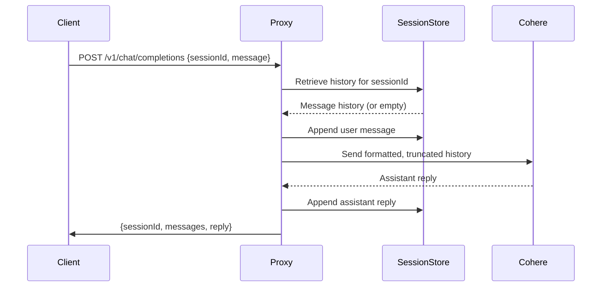

# Multi-Turn Conversation Enhancement Plan (v2)

## Objective
Enable multi-turn conversations by maintaining conversation history, associating sessions with users, and integrating helper functions for message formatting and truncation.

---

## 1. In-Memory Session Store

- Add an in-memory object (e.g., `this.sessions = {}`) to the `CohereProxyServer` class.
- Each session key is a `sessionId` (provided by the client or generated if missing).
- Each session value is an array of message objects (user/assistant turns).

---

## 2. Chat Endpoint Refactor

- Update the `/v1/chat/completions` endpoint to:
  - Accept a `sessionId` in the request body.
  - Retrieve or initialize conversation history for the session.
  - Append the new user message to the session history.
  - Use `formatMessagesForCohereChat` and `intelligentTruncateMessages` to prepare the message array.
  - Send the formatted, truncated history to Cohere.
  - Store the assistant’s reply in the session history.
  - Return `{ sessionId, messages, reply }` in the response.
- Restrict multi-turn session logic to chat-capable models only (e.g., command-r, command-r-plus).

---

## 3. Robust Session & Error Handling

- Initialize history for new sessions.
- Handle expired/invalid sessions by implementing a session TTL (e.g., remove sessions inactive for 30 minutes).
- Gracefully handle API and formatting errors.

---

## 4. Documentation & Examples

- Update usage docs to show the new request/response format.
- Provide example payloads for multi-turn usage.

---

## 5. Mermaid Diagram

---

## Summary

- In-memory session storage is used for conversation history.
- Multi-turn session logic is restricted to chat-capable models.
- The chat endpoint manages conversation history and uses helper functions for formatting and truncation.
- The API response includes the sessionId, updated messages, and the latest reply.
- Robust error handling and updated documentation are included.
- The diagram illustrates the new flow.
