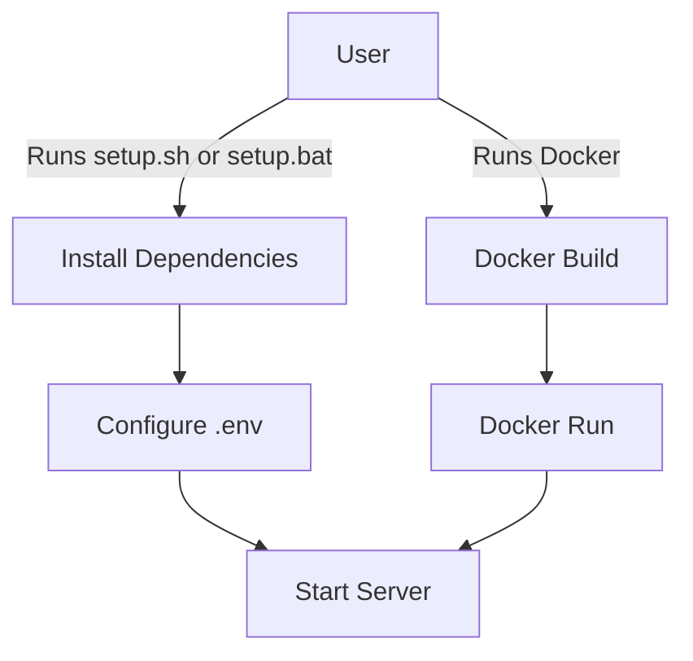

# Standalone & Docker Deployment Improvements

## Summary of Required Changes

### 1. Standalone Installation Improvements
- Add `setup.sh` (bash) and `setup.bat` (batch) scripts:
  - Automate `npm install`
  - Guide user to create/edit `.env`
  - Start the server (`npm start` or `node index.js`)
- Update [`README.md`](../README.md) with:
  - Clear install/start instructions for both platforms
  - Troubleshooting and health check usage

### 2. Dockerization
- Create a `Dockerfile`:
  - Use official Node.js base image
  - Copy source, install dependencies, expose port, set entrypoint
- Add `.dockerignore` to exclude unnecessary files (e.g., node_modules, logs, .env)
- Add Docker usage instructions to [`README.md`](../README.md):
  - Build and run commands
  - Environment variable configuration

### 3. Optional Enhancements
- Add `docker-compose.yml` for multi-service orchestration (if needed)
- Add CI/CD pipeline config for automated builds/tests (e.g., GitHub Actions)

---

## Example Directory Additions

```
/setup.sh
/setup.bat
/Dockerfile
/.dockerignore
/docker-compose.yml (optional)
```

---

## Mermaid: Deployment Workflow



---

## Next Steps

1. Implement scripts and Dockerfile as described.
2. Update documentation.
3. Test both install methods on all platforms.